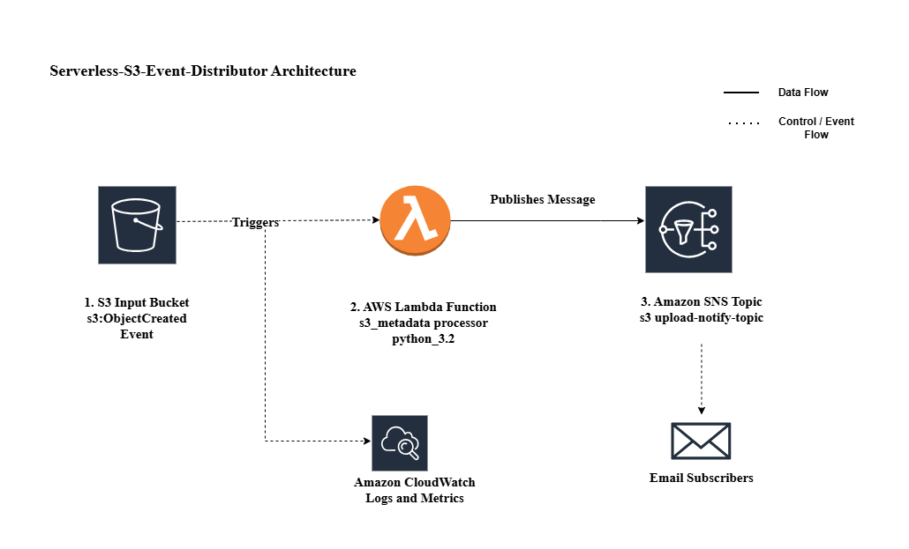

# Serverless S3 Event Distributor

A cloud-native, event-driven automation tool that processes S3 bucket metadata in real-time and alerts subscribers via Amazon SNS.

---
## Project Overview
This project demonstrates a serverless workflow where file uploads to an **Amazon S3** bucket act as a trigger. An **AWS Lambda** function (Python) intercepts the event, extracts critical metadata (Filename, Bucket Name, File Size), and publishes a formatted alert to an **Amazon SNS** topic for instant notification.

This project shows how to build a lightweight automation pipeline without servers.

---

## 🛠️ AWS Services Used

- **Cloud**: AWS (S3, Lambda, SNS, IAM, CloudWatch)

- **Language**: Python 3.x (Boto3 SDK)

---
## Architecture

1. **S3 Bucket**: Acts as the event source (ObjectCreated)

2. **IAM Role**: Provides the Lambda function with **"Least Privilege"** permissions (sns:Publish and logs:CreateLogGroup).

3. **AWS Lambda**: The compute layer that parses the JSON event sent by S3.

4. **Amazon SNS**: The distribution layer that sends emails to subscribed users.

5. **CloudWatch**: Used for real-time monitoring and debugging.



---

## Prerequisites
- AWS Account

- Verified email address in Amazon SNS
---
## Configuration
1. **SNS Setup**: Create a Standard Topic and subscribe your email.

2. **IAM Setup**: Create an Execution Role for Lambda with the following policy:
```json
  {
    "Version": "2012-10-17",
    "Statement": [
        {
            "Effect": "Allow",
            "Action": "sns:Publish",
            "Resource": "YOUR_SNS_TOPIC_ARN"
        }
    ]
}
```
3. **Lambda Setup**: Deploy the lambda_function.py code and attach the S3 trigger.

---

## 🧪 Testing
1. Upload a file to the configured S3 bucket.

2. The Lambda will trigger automatically.

3. Check your email for a message like:

  ```
  "New file uploaded! Bucket: s3-image-moderation-bucket | File: img.jpg | Size: 1024 bytes"

  ```
---

## 📊 Observability & Monitoring
* **Structured Logging:** Centralized application logs in **CloudWatch Logs** with a 14-day retention policy for cost optimization.
* **Proactive Alerting:** Configured **CloudWatch Alarms** to trigger SNS notifications if Lambda execution errors exceed a 0% threshold.
* **Health Dashboard:** Created a custom **CloudWatch Dashboard** to track real-time metrics for S3 ingestion rates and Lambda latency.
---

## 🧠 Key Learnings
1. **Event-Driven Logic**: Learned how to make AWS services "talk" to each other automatically without manual intervention.

2. **Serverless Benefits**: Understood how to build tools that cost ₹0 when not in use and scale instantly when files are uploaded.

3. **Security (IAM)**: Learned to give a service the minimum power it needs to work (Least Privilege), keeping the cloud account safe.

4. **Monitoring**: Used CloudWatch to "see" inside the code and fix errors quickly using logs.

---

## 🚀 Future Enhancements
1. **IaC (Terraform)**: Automate the entire setup so it can be deployed in seconds with one command.

2. **Dead Letter Queue (DLQ)**: Add a "safety net" (SQS) to catch and save any failed notifications for later review.

3. **Database Integration**: Instead of just an email, save the file details into a DynamoDB table for a permanent record.

4. **Image Security**: Use AWS Rekognition to automatically check if an uploaded image is safe or contains specific objects.

---